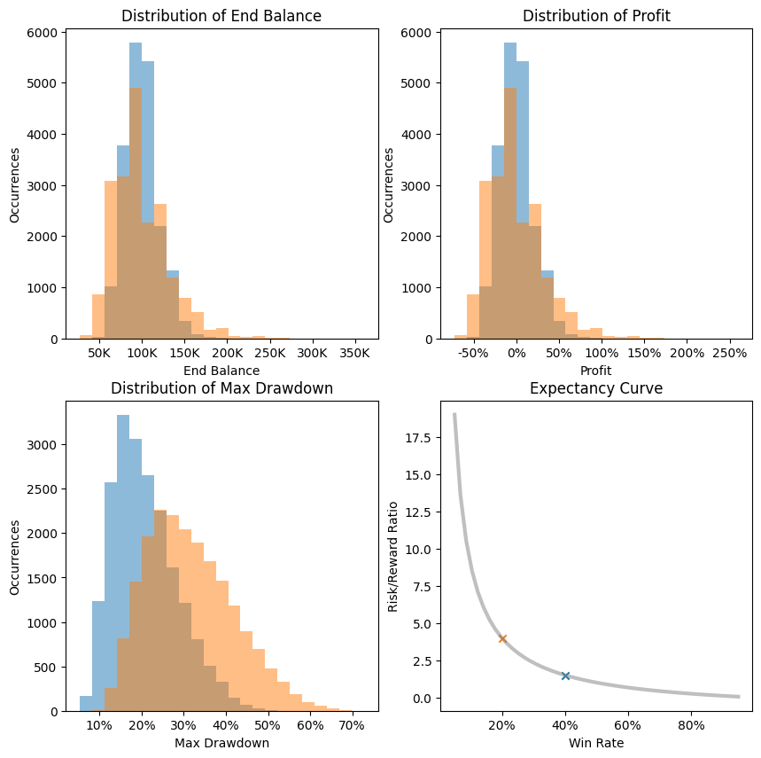

Quickly compare how two different sets of trading parameters affect the result:

Parameters that can be changed: 

 - Account equity
 - Win Rate (AB)
 - Risk/Reward Ratio (AB)
 - Risk% (AB)
 - Samples
 - Simulation samples

The parameters marked with AB are compared to each other.

Both strategies in the example both sit on the Expectancy Curve, meaning that they will break-even. However, they differ a lot of the type of drawdown that is created. The strategy with the lower win rate has a much higher drawdown compared to the strategy with the lower risk/reward ratio. 

From this we can conclude that if both strategies are equal, the one with the higher win ratio will perform better drawdown wise.